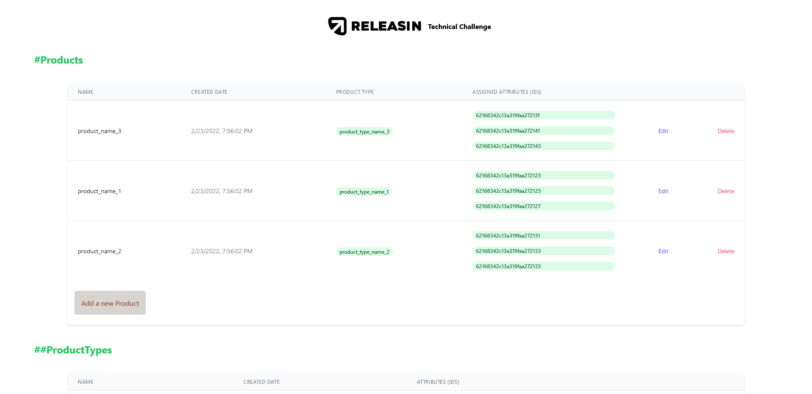

# Technical Assignment.



## Description


This is my submission for the technical challenge , below I'll be explaining how to set up this project and more .

## Technologies & Tools

### Front-end:

* React
* TailwindCSS
* Axios

### Backend and Databse:

* Node/ExpressJS
* Mongoose


## Installation and Usage

### Requirements:

* Node.js installed
* Mongodb connection

### Steps:
1. Clone repo on your local machine:
```
$ git clone git@github.com:Da3az/releasin-test.git
```
2. Install backend dependencies:
```
$ cd backend
$ npm install
```
3. Setting MongoDB connection:
```
//Create .env file on the back-end foder and enter the mongodb connection string , with the name ATLAS_URI

$ ATLAS_URI=<connection_string>
```
4. Initiliaze dummy data
```
// The initValues.js file in the back-end folder will directly initialize data for the project, however you can remove it or comment the line 46 in server.js file
$ initData()
```
5. Run the server
```
$ npm run server

//Now the backend server should br running on port 5000 .
```
6.Add the client .env
```
Create .env file in the client folder and add the next line to it
$ REACT_APP_SERVER=<back-end-url>
If not changed the back-end server is running on http://localhost:5000
```
7. Run the client server
```
$ cd ../client
$ npm install
$ npm run start

The front end is ready on port 3000.
```

## API Endpoints

 Method   | URL                                      | Description                              |
| -------- | ---------------------------------------- | ---------------------------------------- |
| `GET`    | `/product`                             | Retrieve all products.                      |
| `POST`   | `/product/update`                             | Update a product properties (product id is required).                       |
| `POST`    | `/product/delete`                          | Delete a product (id is required)                       |
| `POST`  | `/product/create`                          | Create a product .                 |
| `GET`    | `/productType`                             | Retrieve all productTypes.                      |
| `POST`   | `/productType/update`                             | Update a productType properties (product id is required).                       |
| `POST`    | `/productType/delete`                          | Delete a productType (id is required)                       |
| `POST`  | `/productType/create`                          | Create a productType . 

## Ideas

From my personal view , I see that the modelling can be changed based on the type of database (Relational,NOSQL,Graph ..) used , and if there was a pricing plan that  we should consider so we make the modelling based ob the performance with the best price .
And also We should consider what is the project aim .


The thing that appealed for me the most is the three models (Attribute,AttributeValue,AssignnedAttribute) , On my understanding we have attributes for products type (Attribute), and we want to consider the case when we have special attributes for the product that are out of product type scope so we made the model (AssignedAttribute) , still I have a difficulty understanding why we used three models for that , I hope I'm not missing something but I believe having only the Attribute Value model and adding fields to it if needed would be sufficient .


In our models we are embedding docuemnt on others to define them (for example ProductType om the Porduct model) , and that can lead to having large documents which can cause to problems of different ways , a way to solve that is to use the subset pattern to only access data which is required and that data can lead us to the whole document if we want .
(based on mongodb manual 
 https://docs.mongodb.com/manual/tutorial/model-embedded-one-to-one-relationships-between-documents/)

## Difficulties

I Couldn't find a suitable way to set multiple types for the field Type on the Attribute model , beside the Mixed type which can accept any type .


I might had less time of debugging so I hope there will be no bugs there.


Because the project is small I didn't use the typical controllers or middlewares on the backend .

